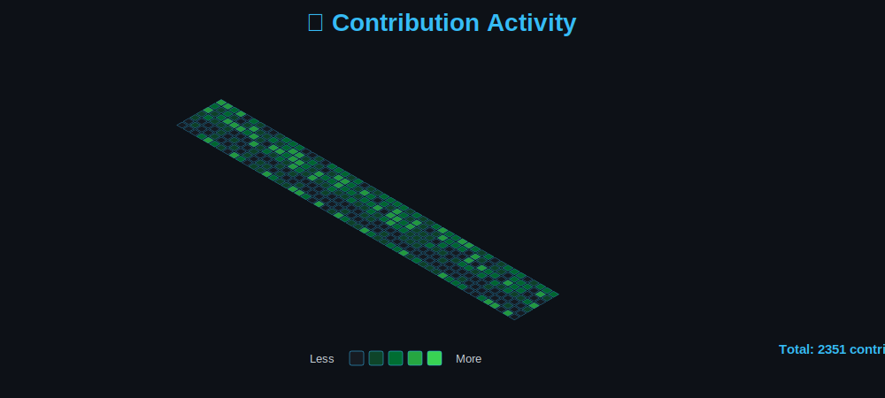

<div align="center">
  
# 👋 Hey there! I'm mediumwarrior67


</div>

---

## 📅 Contribution Activity

<div align="center">
  <picture>
    <source media="(max-width: 768px)" srcset="./contribution-calendar.svg" width="100%">
    
  </picture>
</div>

<br/>

> 🎨 **Smooth isometric design** inspired by modern data visualization<br/>
> [View Interactive Version](./isometric-calendar.html)

---

## 💻 Languages & Technologies

<div align="center">
  
### My Tech Arsenal
  
<p>
  
  
  
  
  
</p>

### 🎯 Interactive Demos

<p>
  <a href="./skills-showcase.html">
    
  </a>
  <a href="./stats-generator.php">
    
  </a>
</p>

</div>

---

## 📊 GitHub Metrics

<div align="center">
  


</div>

<div align="center">
  
</div>

---

## 🎯 About Me

```javascript
const developer = {
    name: "mediumwarrior67",
    role: "Full Stack Developer",
    languages: ["JavaScript", "HTML", "PHP", "Python", "CSS"],
    currentFocus: "Building elegant & efficient solutions",
    hobbies: ["Coding", "Learning", "Open Source"],
    motto: "Write clean code, solve real problems"
};

console.log("Always striving to level up! 🚀");
```

---

## 📫 Let's Connect

<div align="center">

<a href="https://github.com/mediumwarrior67">
  
</a>
<a href="https://discord.com">
  
</a>

</div>

---

<div align="center">
  
  
  ### 💫 *"Code is poetry written in logic"*
  
</div>
